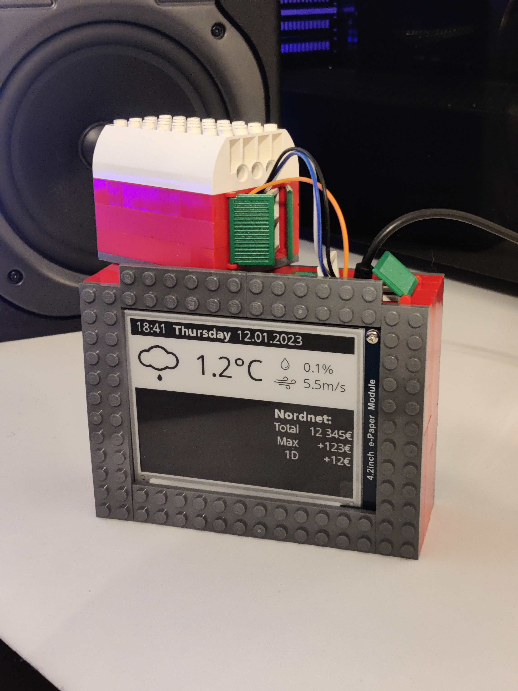

# Raspberry Pi e-Paper multimonitor
This is my very own Raspberry Pi powered monitor for viewing the time, date, various weather information and my Nordnet investment portfolio.

90% of this project has been coded on the Raspberry with Nano and a 60% keyboard without arrowkeys :)

## Features

 - [x] Date and time
 - [x] Temperature, change of precipitation and windspeed
 - [x] Weather icon based on current local weather
 - [x] Nordnet web scraping integration
 - [ ] Indoor air temperature and CO2 reading
 - [ ] Google calendar tasks
 - [ ] More?

## Hardware

 - Raspberry Pi 4 2Gb
 - 4.2'' Waveshare e-Paper display
 - Kick ass custom built lego case
 - (BMP280 Air pressure + temperature sensor)
 
 ## Current looks
 

  

